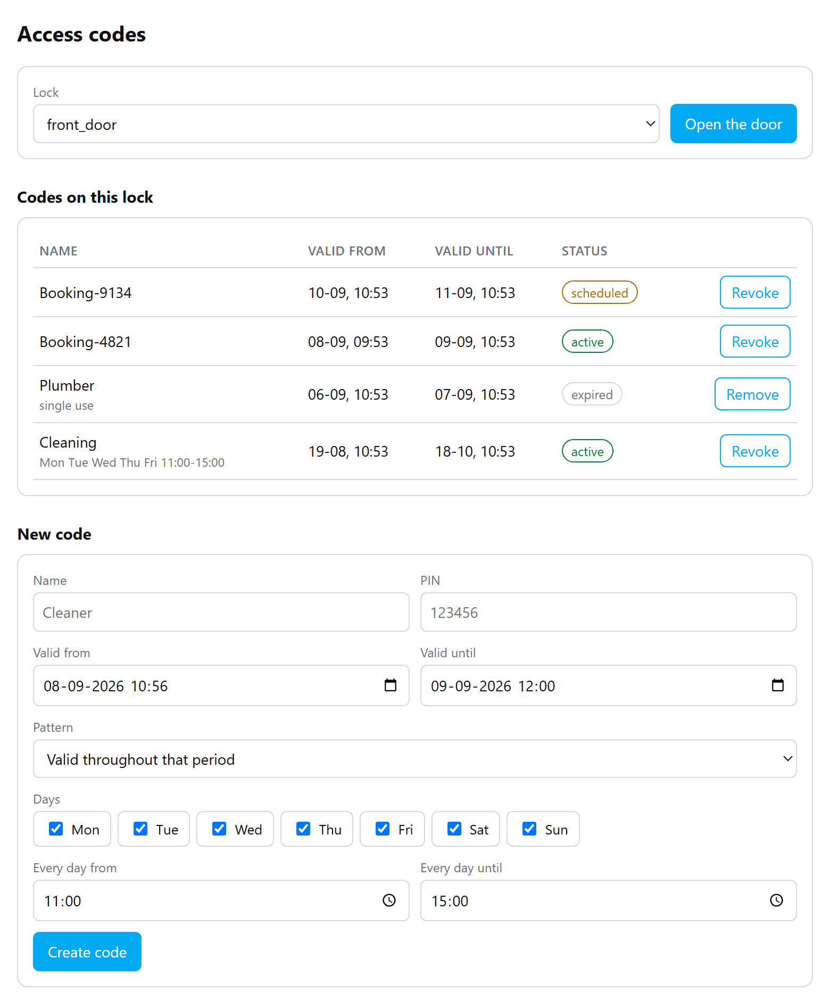

# Tuya Lock Bridge

A Home Assistant add-on that lets you drive Tuya smart locks: unlock a door
remotely and manage temporary access codes — create them, list them, revoke
them, and clear out the expired ones.

Home Assistant's own Tuya integration does not cover this. Its documentation
states that every platform is supported *except* `lock` and `remote`, so a Tuya
keypad shows up there as a read-only binary sensor with no way to control it.
This add-on fills that gap.

If all you need is opening and closing, have a look at
[Xtend Tuya](https://github.com/azerty9971/xtend_tuya) first — a community
integration that does add real `lock` entities for some devices. It does not
manage access codes: its source contains no reference to Tuya's temporary
password APIs at all. And on the keypad this add-on was built against, a Nivian
NV-ACCESS-PIN-RFID-W, its lock entities did not actually open the door. Your
mileage may differ, and if Xtend Tuya covers your case then you do not need
this.

## What you get

- A **Locks** panel in the sidebar to manage codes by hand
- A **button** entity per lock to open the door
- A **sensor** entity per lock with the number of currently valid codes, and the
  full list in its attributes
- An HTTP API for automations — create a code per booking, revoke it afterwards

Codes can be plain, single-use, or carry a recurring daily pattern such as
"every weekday between 11:00 and 15:00" — see the caveat about patterns below.

## Installation

1. Click the badge above, or add
   `https://github.com/leanderdl2/tuya-lock-bridge` as a repository in the
   Home Assistant add-on store.
2. Install **Tuya Lock Bridge**.
3. Fill in your Tuya Access ID, Access Secret and your locks.
4. Start it.

Prebuilt images are published for `amd64` and `aarch64`, so there is
nothing to compile on your own machine.

Full setup instructions, the API reference, and a collection of Tuya quirks that
are not documented anywhere else are in [DOCS.md](tuya_lock_bridge/DOCS.md).

## Which locks

Developed against a Nivian NV-ACCESS-PIN-RFID-W WiFi keypad (Tuya category
`mk`). Unlocking and code management are confirmed working on that physical
hardware. It should work with any Tuya lock that exposes the Smart Lock Open
Service temporary password APIs. Reports about other models are welcome.

**Recurring daily patterns are the exception.** Tuya's documentation states they
are supported only by Zigbee residential lock pro and hotel lock. The cloud does
accept and store a pattern for other locks, but whether your lock enforces the
hours is untested — if it does not, a code meant for "every day 11:00 to 15:00"
simply works around the clock within its outer window. Create one and try it
outside its hours once before relying on it.

## Licence

MIT — see [LICENSE](LICENSE).
